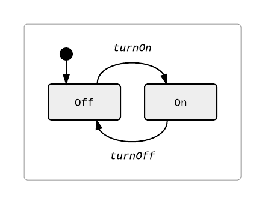

## FSM (Finite-State Machine)
A JavaScript module which provides simple finite-state machine behavior.

These core elements of a traditional finite-state machine are available for configuration:
- State names
- State transitions (_or "events"_)
- Initial state
- Pre-transition behavior
- Post-transition behavior
- Actions always occurring upon state entry
- Actions always occurring upon state exit

### Input Configuration Specification
_(See configuration sample below for JSON structure)_
- `startState`: The state at which a newly created state machine will be initialized.  _[type: string]_
- `states`: An object specifying all possible name-value object pairs for states and transition events. _[type: JS object]_
  - `events`: Contains named objects which give details for the possible transition events for this state. _[type: JS object]_
    - `toState`: The state name to which we will transition when receiving this event.  _[type: string]_
    - `onBefore`: A callback which is fired **before** the state change has occurred.  _[type: function]_
    - `onAfter`: A callback which is fired **after** the state change has occurred.  _[type: function]_
  - `actions`: The actions which will always be executed when a state is entered or exited. (_This is **kind of** conceptually similar to the execution order of constructors/destructors._) _[type: JS object]_
    - `onEnter`: A callback which is fired **every time** the state is entered, regardless of where it just transitioned from.  _[type: function]_
    - `onExit`: A callback which is fired **every time** the state is exited, regardless of where it is transitioning to.  _[type: function]_

_**NOTE**: During creation of a new state machine object, the configuration is validated. If errors are found, the value returned by method `isValid()` will be `false`, and the value from method `status()` will hold the status code of the problem._

### Sample Module Usage _(example 1)_
Let's model a simple light switch; Here's the state diagram:<br/>
<br/>
And the corresponding code would be ...
```javascript
// +-----------------------+
// | Model a light switch. |
// +-----------------------+
var config = {
    startState: 'Off',
    states: {
        'Off': { events: { 'turnOn': { toState: 'On' } } },
        'On': { events: { 'turnOff': { toState: 'Off' } } }
    }
};

// Load the module and call the factory method to create a new instance.
var FSM = require('@pxtrick/fsm');
var fsm = FSM.newFSM(config);

if (fsm.isValid()) {
    // Handle state-changing events.
    fsm.handleEvent('turnOn');   // fsm.currentState() === 'On';
    fsm.handleEvent('turnOff');  // fsm.currentState() === 'Off';
}
```
_**NOTE**: For brevity, the idempotent transitions of_ `[Off]->(turnOff)->[Off]` _and_ `[On]->(turnOn)->[On]` _are not included in this code example._


### Sample Module Usage _(example 2)_
<!-- #### Sample Input Configuration: -->
Let's model a more complex login sequence; Here's the state diagram:<br/>
<br/>
And the corresponding code would be ...
```javascript
// +-------------------------+
// | Model a login sequence. |
// +-------------------------+
var config = {
    startState: 'LoggedOut',
    states: {
        'LoggedOut': {
            events: {
                'login': { toState: 'LoggingIn'}
            },
            actions: {
                onEnter: function() { console.log('You have been logged out.') }
            }
        },
        'LoggingIn': {
            events: {
                'success': { toState: 'LoggedIn'},
                'failure': {
                    toState: 'LoggedOut',
                    onBefore: function() { console.log('Login FAILED.') }
                }
            }
        },
        'LoggedIn': {
            events: {
                'logout': {
                    toState: 'LoggedOut',
                    onAfter: function() { console.log('Thanks for playing!') }
                }
            },
            actions: {
                onEnter: function() { console.log('You are now logged in.') }
            }
        }
    }
};

// Load the module and call the factory method to create a new instance.
var FSM = require('@pxtrick/fsm');
var fsm = FSM.newFSM(config);

if (fsm.isValid()) {
    // Handle state-changing events.
    fsm.handleEvent('login');    // fsm.currentState() === 'LoggingIn';
    fsm.handleEvent('failure');  // fsm.currentState() === 'LoggedOut';
    fsm.handleEvent('login');    // fsm.currentState() === 'LoggingIn';
    fsm.handleEvent('success');  // fsm.currentState() === 'LoggedIn';
    fsm.handleEvent('logout');   // fsm.currentState() === 'LoggedOut';
}
```
_**NOTE**: For brevity, no idempotent transitions are included in this code example._

### Dependencies:
This module is dependent on [lodash](https://www.npmjs.com/package/lodash "Go get it!").
